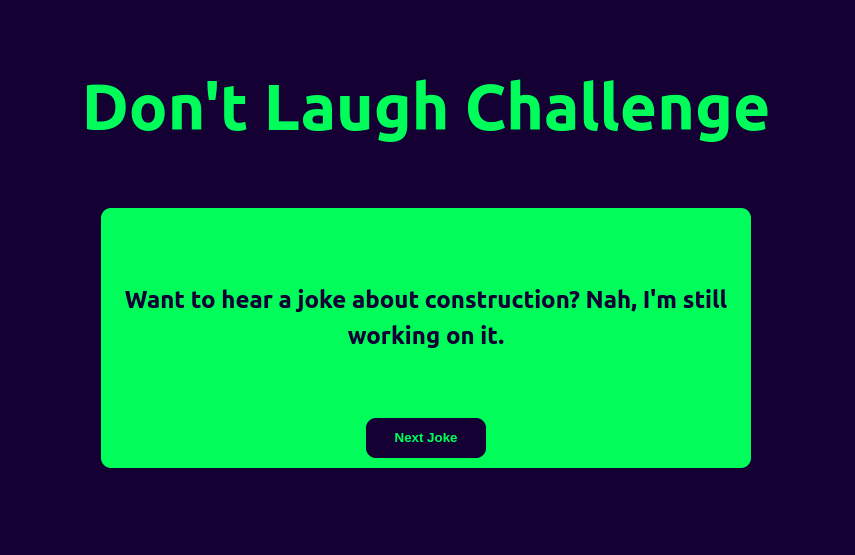

<p align="center">
  
</p>
<h1 align="center">Don't Laugh Challenge</h1>

A very simple project created with Next.JS to bring to bring to us some entertainment.

Hope you enjoy :D

<p align="center">
  
</p>

## Getting Started

First, install the dependencies

```bash
$ npm install
```

Then, run the development server

```bash
$ npm run dev
```

## Credits:
* Idea: https://www.florin-pop.com/blog/2019/09/100-days-100-projects/ 
* Dad Jokes: https://icanhazdadjoke.com/